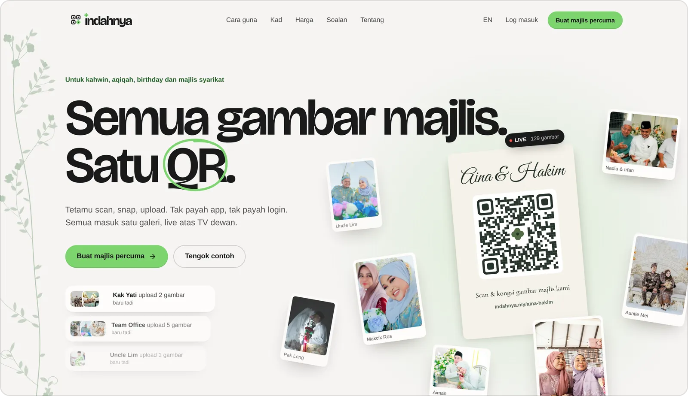
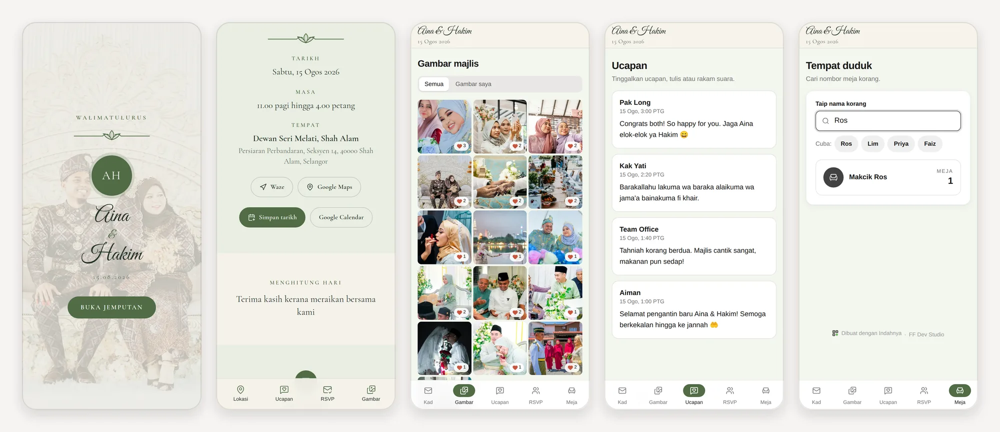
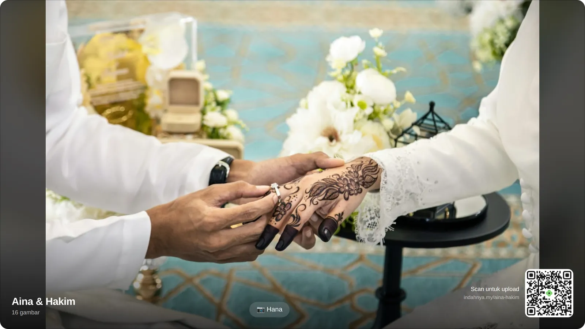
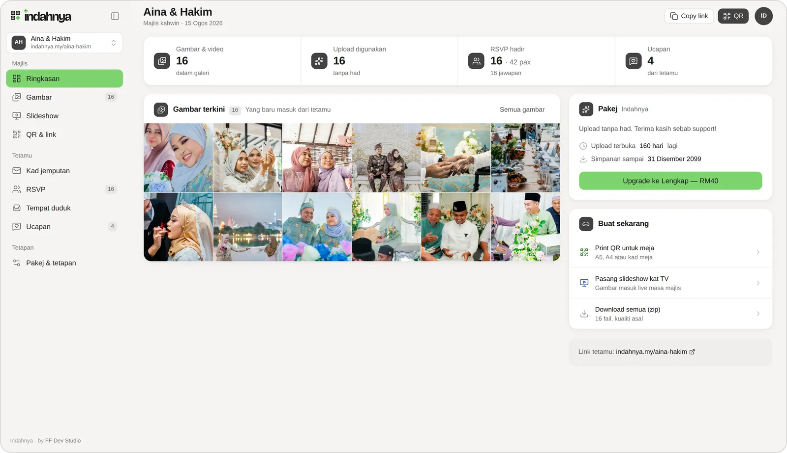
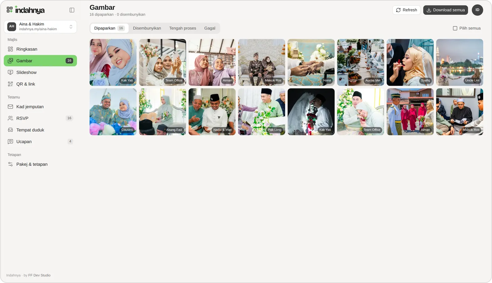
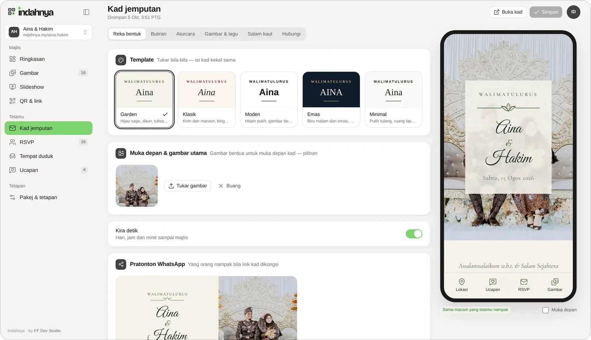
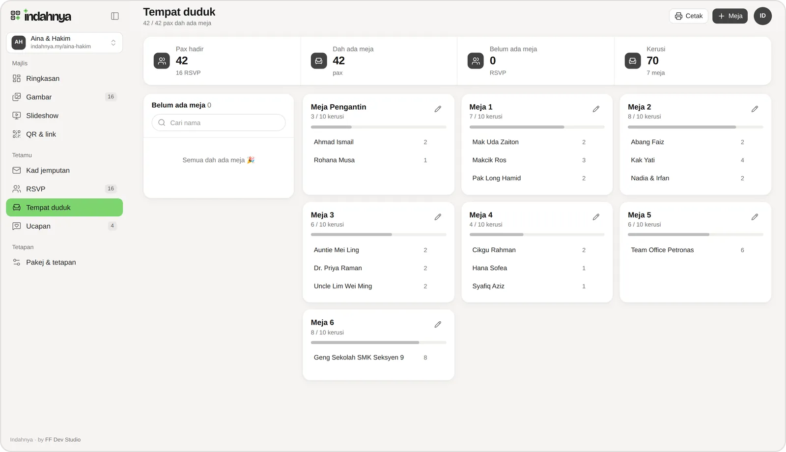
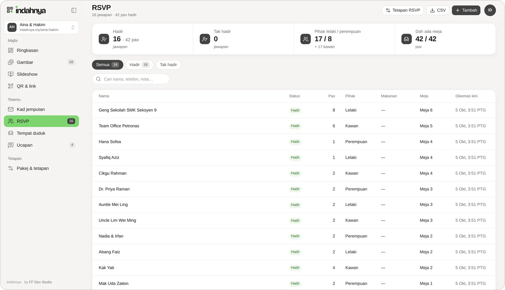
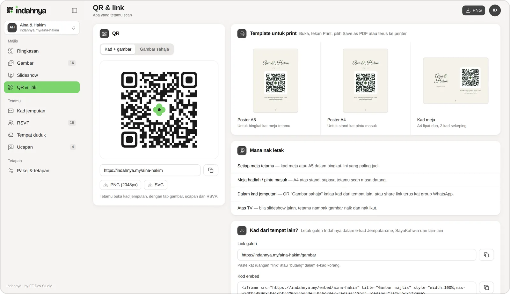

<p align="center">
  <picture>
    <source media="(prefers-color-scheme: dark)" srcset="brand/indahnya-lockup-on-dark.svg">
    
  </picture>
</p>

<p align="center">
  <strong>Guest photo gallery, e-kad and RSVP for Malaysian majlis, in one QR.</strong><br>
  Semua gambar majlis. Satu QR.
</p>

<p align="center">
  
  
  
  
  
  
</p>

<p align="center">
  <a href="#features">Features</a> ·
  <a href="#quick-start">Quick start</a> ·
  <a href="docs/README.md">Docs</a> ·
  <a href="PLAN.md">Plan</a> ·
  <a href="https://indahnya-86v.pages.dev">Preview</a>
</p>

<p align="center">
  
</p>

Guests scan a QR on the table and upload straight from the phone browser,
with no app and no sign-up. Their photos land in one gallery and on the
dewan's TV within seconds. The same link is the couple's e-kad, the RSVP
form, the table finder and the ucapan wall. The host gets a dashboard,
moderation, a zip of every original, printable QR stands, and a one-time
price in Ringgit. Built by [FF Dev Studio](https://ffdev.studio).

## How it works

1. **Letak QR atas meja.** Print the A5 or A4 poster or the folded table
   card. Your names and QR are already laid out.
2. **Tetamu scan, snap, upload.** No app, no login. Photos and short videos
   come straight from the camera roll, and HEIC is fine.
3. **Masuk galeri, naik TV.** Every photo lands in one gallery and on the
   venue slideshow within seconds.

## Features

### For guests

<p align="center">
  
</p>

- **E-kad** (`/aina-hakim`): tap-to-open cover that starts the song, both
  families, date and time, Waze, Google Maps, `.ics` and Google Calendar,
  countdown, aturcara, couple photos, doa, dress code, salam kaut with DuitNow
  QR, and a contact bar. Five templates: Garden, Klasik, Moden, Emas, Minimal.
- **Gambar**: masonry gallery, newest first, with reactions (❤ 🎉 🥲), a
  "Gambar saya" filter and single downloads. Guests can delete their own
  uploads within 24 hours. Uploads retry on a bad line, go up in parts when
  large, and carry on where they stopped if the tab is closed.
- **Ucapan**: written wishes, or voice notes up to 60 seconds recorded in the
  browser.
- **RSVP**: hadir or tak hadir, pax, pihak, meal choice and a note. One reply
  per browser. A phone number links a guest to a reply the host took by phone.
- **Tempat duduk**: type three letters of your name to get your table number.
  Nothing else about anyone leaves the server.
- **Embed**: couples whose kad lives on Jemputan.me or SayaKahwin can paste a
  gallery link or an `<iframe>` widget instead.

### On the venue TV

<p align="center">
  
</p>

Open the TV link on a laptop plugged into the screen and press F11. New photos
slide in on their own. The guest's name shows if the host allows it, and the
corner QR keeps inviting more. Hidden photos leave the screen without a
reload, and rotating the link blanks old screens.

### For hosts

<table>
  <tr>
    <td width="50%"><br><sub><b>Ringkasan:</b> totals, latest photos, plan and clocks, next steps</sub></td>
    <td width="50%"><br><sub><b>Gambar:</b> approve, hide, delete, download everything as a zip of originals</sub></td>
  </tr>
  <tr>
    <td><br><sub><b>Kad jemputan:</b> editor with a live phone preview and the WhatsApp card</sub></td>
    <td><br><sub><b>Tempat duduk:</b> drag guests onto tables, capacity meters, print view</sub></td>
  </tr>
  <tr>
    <td><br><sub><b>RSVP:</b> totals by side, search, add replies taken by phone, CSV export</sub></td>
    <td><br><sub><b>QR &amp; link:</b> branded QR, print templates, embed code</sub></td>
  </tr>
</table>

Plus written and voice ucapan moderation with a "download all" zip, slideshow
settings, approval mode, plan upgrades through Stripe Checkout (FPX,
cards, GrabPay), retention emails before anything is deleted, a 7-day undo
when a majlis is deleted, and account deletion. Every page
works at phone width. See [all screenshots](docs/screenshots.md).

## Pricing

One-time per majlis, no subscription. The free tier is limited by time and
count, never by features.

| | Percuma | Indahnya | Indahnya Lengkap |
|---|---|---|---|
| Price | RM0 | RM59 | RM99 |
| Uploads | 50 | Unlimited | Unlimited |
| Upload window | 30 days after the majlis | 6 months | 12 months |
| Storage | 30 days after the majlis | 12 months | 24 months |
| Kad, RSVP, seating, ucapan, slideshow | ✓ | ✓ | ✓ |
| Custom link `indahnya.my/nama-korang` | – | ✓ | ✓ |
| No Indahnya badge on the kad | – | – | ✓ |

The clocks start on the majlis day, not on sign-up. Upgrading from Indahnya
to Lengkap costs the RM40 difference.

## Stack

| Layer | Choice |
|---|---|
| App | **Nuxt 4** (Vue 3). SSR for the guest pages and the kad, client-only for the host dashboard |
| Data | **Postgres + Drizzle**. Schema in `server/db/schema.ts`, migrations in `server/db/migrations` |
| Media | **S3-compatible, two buckets**: Cloudflare R2 in production, Garage locally. The browser PUTs originals to presigned URLs; the app never touches the bytes |
| Processing | Media worker (`server/plugins/worker.ts`), its own PM2 process in production: sharp, libheif in a child process, ffmpeg. Jobs claimed per lane (photo, video, maint) with `SKIP LOCKED` |
| Payments | **Stripe MY**, one-time Checkout per event, webhook + reconcile |
| UI | **Tailwind v4** and the design system in `app/ui/` (tokens, primitives, motion rules) |
| Hosting | Self-hosted VPS: PM2 (web + worker) + nginx + Postgres, nightly backups off the box, `/api/health` for uptime checks |

Diagrams of the system, the upload pipeline and the data model are in
[docs/architecture.md](docs/architecture.md).

## Quick start

Requirements: Node ≥ 22, Postgres, `ffmpeg`/`ffprobe` on `PATH` (and ideally
libheif's `heif-dec` or `heif-convert` for fast HEIC), and an
S3-compatible store on `:9000` (Garage; see
[docs/development.md](docs/development.md#local-object-storage-garage)).

```bash
cp .env.example .env          # fill DATABASE_URL and the NUXT_S3_* keys
createdb indahnya
npm install
npm run db:migrate
node scripts/dev-bucket.mjs   # CORS on both dev buckets
node --env-file=.env --import tsx scripts/seed-demo.ts   # the sample majlis at /aina-hakim
npm run dev                   # http://localhost:3180
```

Sign-in is by magic link. In dev without `NUXT_SMTP_URL`, the link is printed
to the server log, so copy it from there. Sign in as `demo@indahnya.my` to see
the sample's dashboard.

```bash
npm test                      # unit tests: clocks, prices, retention, redirects, EXIF time, slugs, kad, RSVP, filenames, zip parts
npm run typecheck
```

## Documentation

| Doc | What's in it |
|---|---|
| [docs/architecture.md](docs/architecture.md) | System and pipeline diagrams, buckets, worker jobs, clocks, data model, security choices |
| [docs/development.md](docs/development.md) | Local setup, Garage, scripts, conventions, tests |
| [docs/deployment.md](docs/deployment.md) | Launch checklist, every env var, R2, Stripe, PM2 (web + worker), nginx, backups, health, rollback, the Pages preview |
| [docs/api.md](docs/api.md) | Every route handler, grouped by who calls it |
| [docs/audit-2026-10-05.md](docs/audit-2026-10-05.md) | The production-readiness audit and what was fixed |
| [docs/screenshots.md](docs/screenshots.md) | Every screen, desktop and phone |
| [PLAN.md](PLAN.md) | Product decisions, pricing, phase plan, audit log |
| [brand/README.md](brand/README.md) | The Mekar mark, wordmark, colours, rules |
| [docs/geo/](docs/geo/) | GEO/AEO brief, baseline audit, plan, owner to-dos |

## Project layout

```
app/
  ui/            design system: tokens.css, components/, stores
  components/    AppShell (host dashboard), GuestShell (guest pages), landing/, kad/, guest/
  pages/
    index.vue    landing (BM default, ?lang=en), tentang, privasi, terma
    masuk.vue    sign-in (spends the emailed token)
    app/         host dashboard: /app, /app/[id]/{gambar,slideshow,qr,kad,rsvp,tempat,ucapan,tetapan}
    [slug]/      the e-kad (index), gambar, rsvp, ucapan, tempat
    embed/       the gallery widget for kad on other platforms
    tv/          the venue slideshow
    contoh/      the landing's live demos
  composables/   useUploader, useGuestEvent, useT (BM/EN strings), …
server/
  api/           route handlers: auth, events (host), g/[slug] (guest), tv, stripe
  worker/        media processing, purge and retention sweep, expiry mail, kad GC
  utils/         storage (two buckets), sessions, guests, plans and clocks, RSVP,
                 kad OG renderer, validation, rate limits, slugs
  db/            Drizzle schema and migrations
shared/utils/    code both sides use: kad templates, safeNext, QR art
tests/           Vitest unit tests
brand/           logo files and rules
public/landing/  landing photos (Unsplash licence); s/ = WebP cuts
scripts/         dev-bucket, seed-demo, build-brand/assets/photos, pages preview
docs/            this documentation, images/, geo/
```

## Status

| Phase | Scope | State |
|---|---|---|
| A | Auth, wizard, uploads, gallery, moderation, zip, slideshow, QR, Stripe, retention | Built, audited |
| C | E-kad: 5 templates, editor with live preview, salam kaut, WhatsApp previews, embed | Built |
| B | RSVP, seating, written and voice ucapan | Built |
| Landing | Landing, About, privacy, terms (BM + EN), brand, GEO groundwork | Built |
| Hardening | Production-readiness audit and fixes ([docs/audit-2026-10-05.md](docs/audit-2026-10-05.md)) | Done |
| Launch | Domain, R2, mail (Resend), VPS: live at indahnya.my in pre-launch mode. Stripe MY + legal address | Stripe next |

indahnya.my runs on the production stack (2026-10-10) in pre-launch mode: the
landing and the sample majlis are live, sign-up opens once Stripe is set up
([docs/deployment.md](docs/deployment.md#pre-launch-mode)). Later: Chinese, face search ("cari gambar saya"), WhatsApp reminders,
disposable-camera mode, and a partner API for e-kad platforms.

## Licence

© FF Dev Studio. The source is public for reference. All rights reserved.

Photos under `public/landing/`, which also appear in the sample majlis and in
the screenshots, are by Malaysian photographers on Unsplash under the
[Unsplash License](https://unsplash.com/license). Credits are in
`scripts/landing-photos.json`. The people pictured have no connection with
Indahnya, and the names shown are made up.
