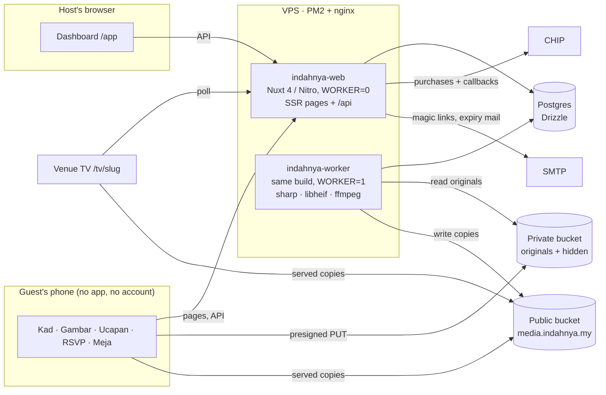
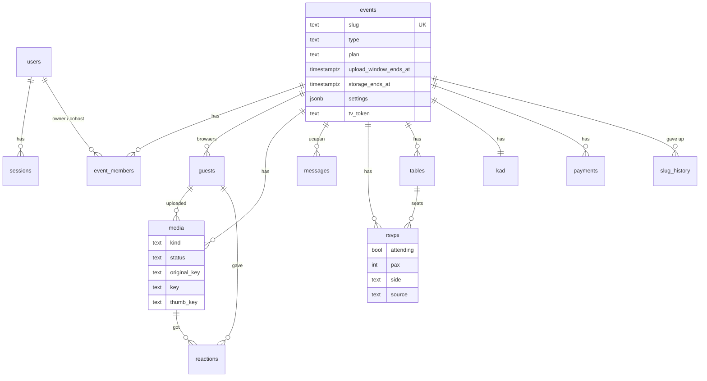

# Architecture

How Indahnya is put together: a Nuxt web process, a media worker process, one Postgres, two buckets.
[PLAN.md](../PLAN.md) holds the decisions and the reasons behind them. This page
describes the system as it stands in the code.

## System



- **Two processes, one build.** `indahnya-web` (`WORKER=0`) serves the pages
  and the API and never processes media. `indahnya-worker` runs the job loop
  in `server/plugins/worker.ts`, so an encode never competes with a guest's
  request. In dev one process does both. HEIC is decoded in a child process
  (libheif's CLI, or heic-convert in a throwaway `node`), never on an event
  loop. Rate limits and job claims live in Postgres, so more web processes
  are safe.
- **The app never touches upload bytes.** Guests PUT straight to the private
  bucket through presigned URLs. Content type and exact `Content-Length` are
  signed, so a 3 MB slot can't take 5 GB.
- **Two buckets.** The public bucket only ever holds served copies of visible
  media. Originals (full EXIF, GPS included), hidden media and approval-pending
  media live in the private bucket, which has no public access. Hiding a photo
  moves its copies across buckets, so a copied link stops working and can't be
  guessed back.

## Rendering

| Area | Routes | Rendering |
|---|---|---|
| Landing, About, legal | `/`, `/tentang`, `/privasi`, `/terma` | SSR, BM by default, `?lang=en` |
| E-kad and guest pages | `/[slug]`, `/[slug]/{gambar,ucapan,rsvp,tempat}` | SSR (WhatsApp previews, fast first paint) |
| Gallery widget | `/embed/[slug]` | SSR, the only route that may be framed |
| Host dashboard | `/app`, `/app/[id]/…` | Client-only (`ssr: false`), `noindex` |
| Sign-in | `/masuk` | Client-only, spends the emailed token with a POST |
| Venue slideshow | `/tv/[slug]?token=` | Client-only, bearer token, `no-referrer` |

Route rules (security headers, `noindex`, framing) are in `nuxt.config.ts`.

## Upload pipeline

```mermaid
sequenceDiagram
  autonumber
  participant P as Guest phone
  participant A as Nitro API
  participant DB as Postgres
  participant S as Private bucket
  participant W as Worker
  participant B as Public bucket

  P->>A: POST /api/g/:slug/uploads {name, type, bytes}
  A->>DB: check caps + window, insert media(status=pending)
  A-->>P: presigned PUT, or one URL per 8 MB part over 16 MB<br/>(type + size signed, 3 h)
  P->>S: PUT original (or its parts)
  P->>A: POST /api/g/:slug/uploads/:id/complete {parts?}
  A->>S: complete multipart, HEAD (size matches?)
  A->>DB: status=uploaded + enqueue process_media, one transaction
  W->>DB: claim job in its lane (FOR UPDATE SKIP LOCKED)
  W->>S: read original
  W->>W: HEIC→JPEG (child process), EXIF time,<br/>2400 JPEG + 1200/480 WebP, metadata stripped;<br/>video: ffprobe, poster, 720p H.264, metadata stripped
  W->>B: write served copies (cache 1 h)
  W->>DB: status=ready
  Note over P,B: Gallery and TV only ever show ready rows
```

Processing lives in `server/worker/process-media.ts`. A file that can't be
decoded fails at once and the guest is told. Bucket, network or database
errors (and a tool timeout on a busy box) are retried with backoff, three
attempts in all. No served copy carries metadata: phones write GPS into
photos and videos, and the public bucket is public.

In a free (capped) gallery a slot holds its place for 20 minutes
(`SLOT_HOLD_MIN`), a browser holds at most 10 at a time, and one address at
most 40 per window. A slot that finishes after its hold gets in only if there
is still room. The uploader (`app/composables/useUploader.ts`) asks for slots
ahead of need, sends three files at a time, aborts a transfer stalled for
45 s, keeps the screen awake, and keeps unsent files in IndexedDB, so a
killed tab carries on when the page is opened again.

## Worker jobs

| Job | What it does | Trigger |
|---|---|---|
| `process_media` | Turns an uploaded original into served copies | Each completed upload (lane `photo` or `video`) |
| `purge_event` | Re-checks under a row lock that the event is due, then hard-deletes both buckets' bytes, guests, RSVPs, wishes and the kad's personal fields; a tail pass runs after the PUT window | Retention sweep, 7 days after a host delete, at once on account deletion (lane `maint`) |
| `kad_gc` | Removes kad uploads the host never saved | Booked a day after any kad upload (lane `maint`) |
| sweep + notify | Retention mails (catching up if missed), purge queueing, stale slots, lost jobs | Hourly, and 15 s after start |
| housekeeping | Closes jobs whose last attempt died, prunes sessions, tokens, done jobs, rate-limit windows | Hourly |
| sandbox sweep | Clears the landing's "cuba sekarang" uploads | Every 10 minutes |

Jobs are rows in `jobs`, claimed per lane with `SKIP LOCKED`, lowest priority
first: `photo` (2 at a time), `video` (1), `maint` (1). A running job stamps
its lock every minute; a lock quiet for 5 minutes belonged to a dead process
and the job is taken again, at most 3 attempts in all. On SIGTERM the worker
stops claiming and waits up to 25 s for running jobs. `/api/health` reports
the worker's heartbeat and the photo queue's oldest wait.

## Clocks and plans

Upload and storage windows run from the **later** of payment (or creation) and
the end of the majlis day, with the lead capped. A free gallery made eight
weeks early still opens on the day. Rules and tests: `server/utils/plans.ts`,
`tests/plans.test.ts`.

| Plan | Price | Uploads | Upload window | Storage |
|---|---|---|---|---|
| `free` (Percuma) | RM0 | 50 | 30 days | 30 days |
| `std` (Indahnya) | RM59 | unlimited | 6 months | 12 months |
| `full` (Indahnya Lengkap) | RM99 | unlimited | 12 months | 24 months |

(`PLANS` also carries co-host counts for when invites are built; they are
parked and not sold.)

Retention (`server/utils/retention.ts`): when storage ends there is a 30-day
grace month. Mails go 14 days before, on the day, and a final warning from day
23; the purge waits until that final warning has been out 7 days. If no
final warning could ever be sent, the purge happens 45 days after storage
ended and someone is alerted. A renewal is offered in the last 30 days of
storage and during the grace month, never once the purge is due or begun.
Upgrading from `std` to `full` charges the difference (RM40).

A payment buys exactly the offer priced at checkout (`payments.kind`,
amount, MYR). If that offer is gone when the money lands (a second person
paid the same upgrade, the gallery was purged), the payment is recorded,
flagged `needs_refund` and alerted, never reinterpreted
(`server/utils/payments.ts`).

## Data model



A guest is a browser, not a person: the cookie token is the identity. Besides
these: `jobs` (the queue, with lanes), `rate_limits` (unlogged counters),
`heartbeats` (worker liveness), `login_tokens`. The full schema with comments
is in `server/db/schema.ts`. Migrations are in
`server/db/migrations` (Drizzle Kit).

## Security choices worth knowing

- Sign-in links are spent only when the host taps "Log masuk" on `/masuk`
  (a JSON POST), never by the GET or on load, so mail scanners can't burn
  them and no other site can sign a visitor in. Session and sign-in tokens
  are stored as SHA-256 hashes. In production a missing `NUXT_SMTP_URL` stops
  the server from starting: links are never written to a log.
- Redirects after sign-in go through `shared/utils/safe-next.ts` (no
  `//evil.com`).
- Rate limits (sign-in, uploads, RSVP, ucapan, reactions, the sandbox) are
  counted in Postgres and keyed on `X-Real-IP`, trusted only when the
  connection comes from loopback (nginx). `X-Forwarded-For` is never read:
  its first entry is whatever the client typed.
- A Content-Security-Policy is built at runtime from the config
  (`server/plugins/csp.ts`); only `/embed` may be framed by other sites.
- A slug an event gave up is never reusable (`slug_history`) and redirects to
  the event's current slug, so a printed QR can't be taken over.
- Served media is cached for an hour, not a year, and purged from
  Cloudflare's edge on hide/delete when configured.
- RSVP has no public name search. A phone number can only claim a reply the
  host entered, so knowing someone's number doesn't let you rewrite their RSVP.
- Seat search returns at most five matches, with name, pax and table only.
- The kad editor saves with a row lock and a version, so a stale tab gets a
  409 rather than overwriting a co-host's changes.

## Design system

`app/ui/` holds the tokens (`tokens.css`), the primitives (`components/`) and
the motion rules:

- One warm ground, white cards with a hairline and a soft lift.
- Charcoal primary actions. The green accent only ever carries ink-coloured text.
- An animation never owns the resting state. There are no route transitions,
  and `.reveal` keyframes have no fill mode.

Guest pages use the same language, one size warmer. Brand rules and files are
in [`brand/README.md`](../brand/README.md).
