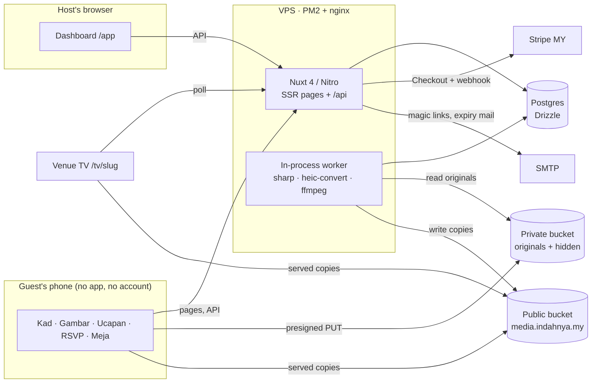
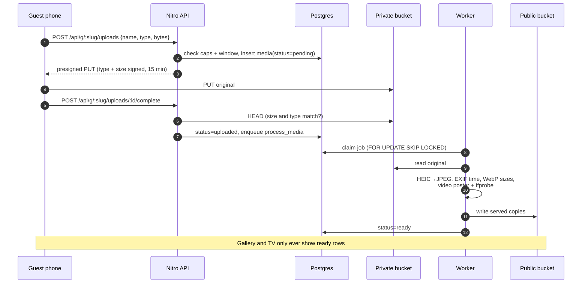
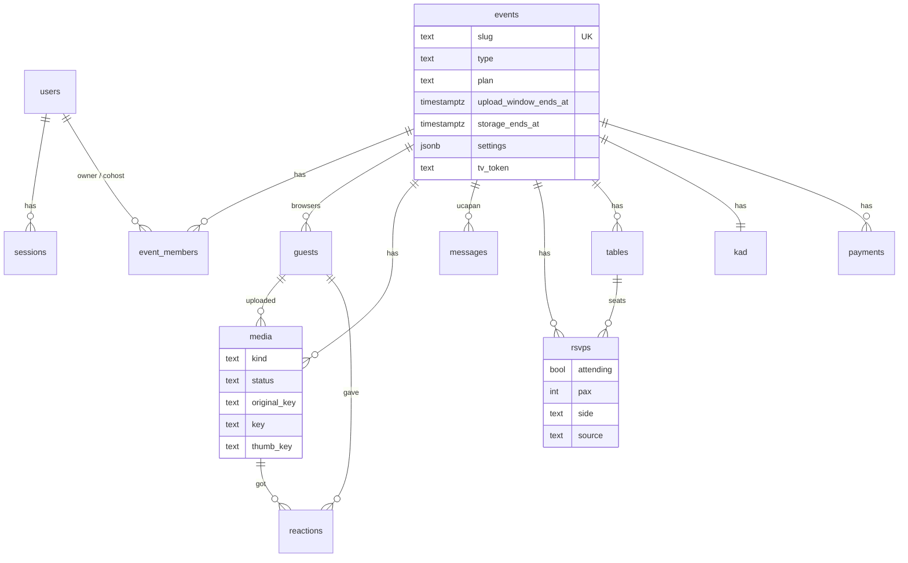

# Architecture

How Indahnya is put together: one Nuxt process, one Postgres, two buckets.
[PLAN.md](../PLAN.md) holds the decisions and the reasons behind them. This page
describes the system as it stands in the code.

## System

- **One process.** Nitro serves the pages and the API. `server/plugins/worker.ts`
  runs the job loop in the same process. Set `WORKER=0` on any extra web-only
  instance.
- **The app never touches upload bytes.** Guests PUT straight to the private
  bucket through presigned URLs. Content type and exact `Content-Length` are
  signed, so a 3 MB slot can't take 5 GB.
- **Two buckets.** The public bucket only ever holds served copies of visible
  media. Originals (full EXIF, GPS included), hidden media and approval-pending
  media live in the private bucket, which has no public access. Hiding a photo
  moves its copies across buckets, so a copied link stops working and can't be
  guessed back.

## Rendering

| Area | Routes | Rendering |
|---|---|---|
| Landing, About, legal | `/`, `/tentang`, `/privasi`, `/terma` | SSR, BM by default, `?lang=en` |
| E-kad and guest pages | `/[slug]`, `/[slug]/{gambar,ucapan,rsvp,tempat}` | SSR (WhatsApp previews, fast first paint) |
| Gallery widget | `/embed/[slug]` | SSR, the only route that may be framed |
| Host dashboard | `/app`, `/app/[id]/…` | Client-only (`ssr: false`), `noindex` |
| Sign-in | `/masuk` | Client-only, spends the emailed token with a POST |
| Venue slideshow | `/tv/[slug]?token=` | Client-only, bearer token, `no-referrer` |

Route rules (security headers, `noindex`, framing) are in `nuxt.config.ts`.

## Upload pipeline

Processing lives in `server/worker/process-media.ts`. A file that can't be
decoded fails at once and the guest is told. Bucket, network or database
errors are retried with backoff, three attempts in all.

## Worker jobs

| Job | What it does | Trigger |
|---|---|---|
| `process_media` | Turns an uploaded original into served copies | Each completed upload |
| `purge_event` | Hard-deletes an event's bytes from both buckets | Retention sweep, host delete |
| `kad_gc` | Removes kad uploads the host never saved | Booked a day after any kad upload |
| sweep + notify | Retention: warning mails, then purge after the grace month | Hourly, and 15 s after start |
| sandbox sweep | Clears the landing's "cuba sekarang" uploads | Every 10 minutes |

Jobs are rows in `jobs`, claimed with `SKIP LOCKED`, at most two at a time per
process.

## Clocks and plans

Upload and storage windows run from the **later** of payment (or creation) and
the end of the majlis day, with the lead capped. A free gallery made eight
weeks early still opens on the day. Rules and tests: `server/utils/plans.ts`,
`tests/plans.test.ts`.

| Plan | Price | Uploads | Upload window | Storage | Co-hosts |
|---|---|---|---|---|---|
| `free` (Percuma) | RM0 | 50 | 30 days | 30 days | 0 |
| `std` (Indahnya) | RM59 | unlimited | 6 months | 12 months | 1 |
| `full` (Indahnya Lengkap) | RM99 | unlimited | 12 months | 24 months | 5 |

When storage ends there is a 30-day grace month with warning mails, then a hard
delete. A renewal is offered in the last 30 days of storage and during the
grace month. Upgrading from `std` to `full` charges the difference (RM40).

## Data model

A guest is a browser, not a person: the cookie token is the identity. The full
schema with comments is in `server/db/schema.ts`. Migrations are in
`server/db/migrations` (Drizzle Kit).

## Security choices worth knowing

- Sign-in links are spent with a POST from `/masuk`, never a GET, so mail
  scanners can't burn them. In production a missing `NUXT_SMTP_URL` is an
  error: links are never written to a log.
- Redirects after sign-in go through `shared/utils/safe-next.ts` (no
  `//evil.com`).
- Rate limits on sign-in, uploads, RSVP and ucapan read `X-Forwarded-For` from
  nginx.
- RSVP has no public name search. A phone number can only claim a reply the
  host entered, so knowing someone's number doesn't let you rewrite their RSVP.
- Seat search returns at most five matches, with name, pax and table only.
- The kad editor saves with a row lock and a version, so a stale tab gets a
  409 rather than overwriting a co-host's changes.

## Design system

`app/ui/` holds the tokens (`tokens.css`), the primitives (`components/`) and
the motion rules:

- One warm ground, white cards with a hairline and a soft lift.
- Charcoal primary actions. The green accent only ever carries ink-coloured text.
- An animation never owns the resting state. There are no route transitions,
  and `.reveal` keyframes have no fill mode.

Guest pages use the same language, one size warmer. Brand rules and files are
in [`brand/README.md`](../brand/README.md).
