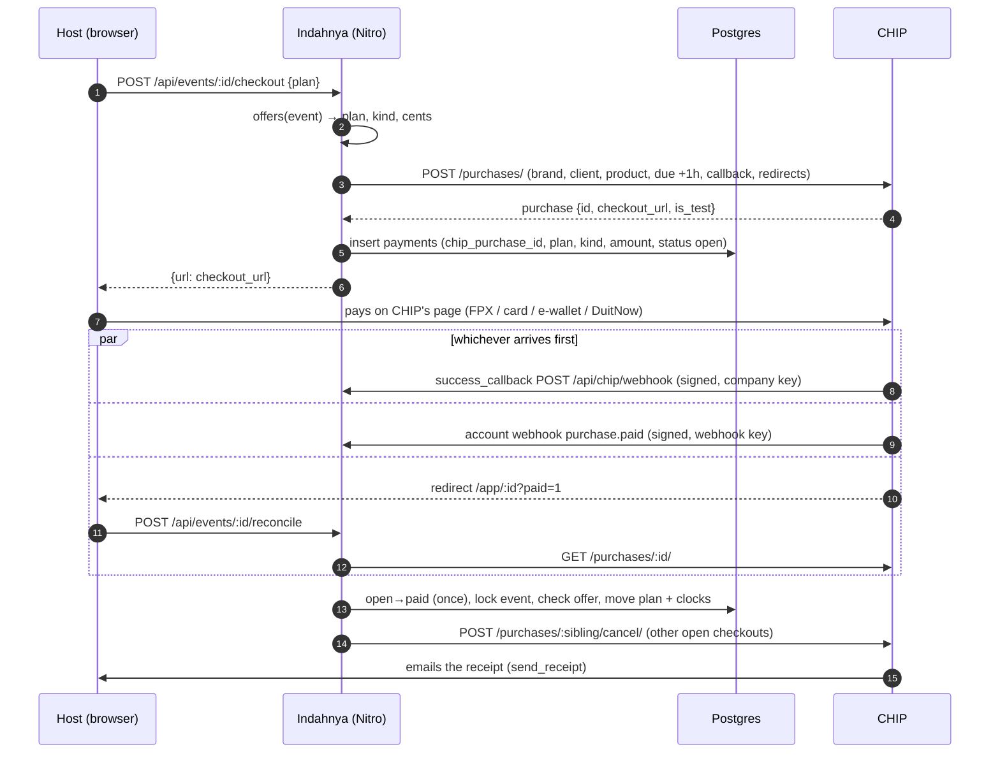

# Payments: CHIP

Everything about how Indahnya takes money, from the account to the last
edge case. Payments go through **CHIP Collect** (chip-in.asia), a Malaysian
gateway: FPX, cards, DuitNow QR and e-wallets, in MYR. CHIP replaced Stripe
on 2026-10-10 (Fakhrul's decision); nothing of Stripe is left in the code.

Contents:

1. [The account](#1-the-account)
2. [What is sold](#2-what-is-sold)
3. [The whole flow](#3-the-whole-flow)
4. [Data model](#4-data-model)
5. [Checkout](#5-checkout)
6. [How a payment lands](#6-how-a-payment-lands)
7. [The webhook endpoint](#7-the-webhook-endpoint)
8. [Reconcile and expiry](#8-reconcile-and-expiry)
9. [Refunds, chargebacks, alerts](#9-refunds-chargebacks-alerts)
10. [What the host sees](#10-what-the-host-sees)
11. [Configuration](#11-configuration)
12. [Setup script: deploy/chip.mjs](#12-setup-script-deploychipmjs)
13. [Going live](#13-going-live)
14. [Testing](#14-testing)
15. [Operations runbook](#15-operations-runbook)
16. [CHIP behaviour reference](#16-chip-behaviour-reference)
17. [Decisions and known gaps](#17-decisions-and-known-gaps)
18. [Files](#18-files)

---

## 1. The account

| | |
|---|---|
| Company | FF DEV STUDIO (202603234793), on CHIP as **FF DEV STUDIO** |
| Portal | portal.chip-in.asia → CHIP Collect. Log in from the **FF Dev** Chrome profile (hello@ffdev.studio) |
| Brand ID | `1e08bc78-5227-4a3d-807e-6390a85d8666`, the same in test and live mode |
| API keys | Portal → Developers → API Keys. A **Test key** and a **Live key** exist (both created 2026-10-10). The sidebar's Test Mode switch decides which one the page shows |
| API host | `https://gate.chip-in.asia/api/v1`, one host for both modes. The key decides the mode |
| Docs | docs.chip-in.asia; the canonical spec is `docs.chip-in.asia/openapi/chip-collect.yaml` |

Fees (chip-in.asia/pricing, plus 8% SST on the fee, settled to the bank):

| Method | Fee | On RM59 | Settlement |
|---|---|---|---|
| FPX (personal) | RM1.00 flat | RM1.08 | next day |
| FPX B2B1 (business) | RM2.00 flat | RM2.16 | next day |
| Local card | 2.0% credit, 1.0% debit | up to RM1.27 | 2 business days |
| Foreign card | 3.0% | RM1.91 | 2 business days |
| DuitNow QR | 1.0%, min RM0.15 | RM0.64 | next day |
| E-wallets (TNG, GrabPay, ShopeePay…) | 1.4% | RM0.89 | 2 business days |
| Atome (pay later) | 5.3% | RM3.38 | |

Refunds cost nothing except on FPX (RM1 / RM2). No setup or monthly fee.

## 2. What is sold

One-off payments per majlis; no subscriptions, no stored cards, no automatic
charges. Prices live in `server/utils/plans.ts` (`PLANS`), in sen:

| Plan | Price | Upload window | Storage |
|---|---|---|---|
| Percuma (`free`) | RM0 | 30 days | 30 days |
| Indahnya (`std`) | RM59 | 183 days | 365 days |
| Indahnya Lengkap (`full`) | RM99 | 365 days | 730 days |

`offers(event)` decides what an event may buy **right now**:

- **Upgrade** to a higher plan. From a paid plan only the difference is
  charged (Indahnya → Lengkap = RM40), and the clocks run from the anchor the
  paid plan started at, so RM40 buys the longer plan, not two fresh years.
- **Renewal** of the same paid plan, offered in the last 30 days of storage
  and in the grace month after it. Storage continues from where it ends.
- Nothing for a purged or deleted event, or one whose purge has begun.

Both clocks start from the later of the payment and the end of the majlis
day (capped 540 days ahead). `clocksAfterPayment` never shortens a clock.

## 3. The whole flow



All three paths call the same `applyPaidPurchase`, which is idempotent on the
purchase id: the first one wins, the others change nothing.

## 4. Data model

Table `payments` (`server/db/schema.ts`), one row per checkout attempt:

| Column | Meaning |
|---|---|
| `id` | Our id (ULID). Also sent to CHIP as the purchase `reference`, so the portal's Reference column shows it |
| `event_id`, `user_id` | The majlis, and who started the checkout |
| `chip_purchase_id` | The CHIP purchase (uuid). Unique (`payments_purchase_uq`). Refunds and events refer to it |
| `plan`, `kind`, `amount_cents` | Exactly what was priced: `std`/`full`, `upgrade`/`renew`, sen. A payment buys this or is refunded, never something else |
| `status` | `open` → `paid`, or `open` → `expired`; `paid` → `refunded` (full refund only) |
| `needs_refund` | Paid, but nothing was applied (offer gone, wrong amount, event purged): someone must refund it |
| `note` | Why a refund is needed, or the refund history ("RM15.00 of RM59.00 refunded so far") |
| `method` | How it was paid, as CHIP reports it: `fpx`, `visa`, `mastercard`, `duitnow_qr`, `razer_tng`… |
| `created_at`, `paid_at` | |

Migration `0007_chip.sql` renamed `stripe_session_id` → `chip_purchase_id`
(and its index), dropped `stripe_payment_intent` (CHIP uses one id for
everything) and added `method`. No production payment existed before it.

Our status from CHIP's:

| CHIP purchase status | Ours | Why |
|---|---|---|
| `created`, `sent`, `viewed`, `overdue` | `open` | not paid yet |
| `error` | `open` | a failed **attempt**; the buyer can retry on the same page |
| `pending_execute`, `pending_charge` | `open` | money moving (slow FPX); `paid` follows or fails |
| `paid`, `cleared`, `settled` | `paid` | `cleared`/`settled` are later states of a paid card purchase |
| `cancelled`, `expired`, `blocked` | `expired` | can no longer be paid |
| `refunded` | `paid` + note, or `refunded` | CHIP says `refunded` after a partial refund too; `refundable_amount` decides |
| `chargeback` | unchanged + alert | |

## 5. Checkout

`POST /api/events/:id/checkout` with `{ plan: 'std' | 'full' }`
(`server/api/events/[id]/checkout.post.ts`). Host or co-host only
(`requireEventAccess`). It refuses a plan that is not in `offers(event)`.

The purchase it creates:

```jsonc
{
  "brand_id": "<NUXT_CHIP_BRAND_ID>",
  "client": { "email": "<host's email>", "full_name": "<host's name, if any>" },
  "purchase": {
    "currency": "MYR",
    "timezone": "Asia/Kuala_Lumpur",
    "due_strict": true,                      // past `due` it cannot be paid
    "products": [{ "name": "Indahnya — Aina & Hakim", "price": 5900, "quantity": 1 }],
    "metadata": { "paymentId", "eventId", "plan", "kind", "cents", "userId" }
  },
  "reference": "<payments.id>",
  "due": "<now + 3600 s>",                   // payable for one hour
  "send_receipt": true,                      // CHIP emails the receipt
  "success_callback": "<site>/api/chip/webhook",
  "success_redirect": "<site>/app/<id>?paid=1",
  "failure_redirect": "<site>/app/<id>/tetapan?bayaran=gagal",
  "cancel_redirect":  "<site>/app/<id>/tetapan",
  "creator_agent": "indahnya",
  "platform": "api"
}
```

- The product name is "Indahnya", "Indahnya Lengkap", "Naik taraf ke …" or
  "Lanjutan …", then the majlis title, cut to CHIP's 256 characters.
- `<site>` is `NUXT_PUBLIC_SITE_URL`. The callback URL may not carry a port.
- Callback and redirect fields sit at the **top level**: placed inside
  `purchase`, CHIP accepts the request and silently ignores them.
- The row is inserted after CHIP answers; a purchase whose insert failed lapses
  unpaid after the hour.
- A purchase made with a test key logs `[chip] TEST purchase …`.

## 6. How a payment lands

`applyPaidPurchase(purchase)` in `server/utils/payments.ts`, from any of the
three paths:

1. Not `paid`/`cleared`/`settled` → nothing.
2. One conditional UPDATE: `open` or `expired` → `paid` (with `paid_at`,
   `method`). If no row changes, the purchase is unknown, already applied or
   refunded: done. This is what makes duplicates and races harmless. An
   `expired` row may still turn paid: an FPX payment can resolve after the
   hour, or after a sibling was paid.
3. Lock the event row (`FOR UPDATE`), then check, in order:
   - the event still exists;
   - CHIP's amount (`payment.amount`, else `purchase.total`) equals
     `amount_cents` and the currency is MYR;
   - the event is not purged, purging or deleted;
   - the exact offer (plan, kind, cents) is still on `offers(event)`.

   Any failure: the payment stays `paid`, gets `needs_refund` and a `note`,
   and an alert goes out. It is never reinterpreted as something else.
4. Apply: upgrade moves `plan` and sets `plan_paid_at`; renewal keeps the
   plan and its anchor; both move the clocks (`clocksAfterPayment`) and reset
   the retention mails (`notified`, `finalWarningAt`).
5. Cancel the event's other `open` purchases at CHIP
   (`POST /purchases/:id/cancel/`): they were priced against the state that
   just changed. A sibling that turns out to be paid meanwhile goes through
   `applyPaidPurchase` itself (and is flagged for a refund, since its offer is
   gone). A cancel that fails is logged; that sibling's own event or the next
   reconcile settles it.

## 7. The webhook endpoint

`POST /api/chip/webhook` (`server/api/chip/webhook.post.ts`) receives both:

- each purchase's **success callback**, signed with the **company key**; and
- the **account webhook**, signed with **that webhook's own key**.

The body is the purchase (or, for `payment.*`, the Payment) with an
`event_type` field added.

**Signature.** Header `X-Signature`: base64 RSA PKCS#1 v1.5 over the SHA-256
of the **raw body bytes** (`readRawBody(event, false)`, verified before any
JSON parsing). `verifyDelivery` in `server/utils/chip.ts`:

1. try `NUXT_CHIP_WEBHOOK_PUBLIC_KEY`;
2. try the company key from `GET /public_key/` (a JSON-encoded PEM string,
   cached per process for 24 hours);
3. if both fail, fetch the company key again (it may have rotated), but at
   most once a minute, so forged requests cannot turn into calls to CHIP.

Keys stored on one line with literal `\n` are unescaped first.

**Responses.**

| Situation | Answer | CHIP does |
|---|---|---|
| No body | 400 | |
| Signature does not verify | 401 | retries; nothing changes |
| Company key cannot be fetched | 503 | retries later (not the same as a bad signature) |
| Verified, any event, handled or not | 200 `{received: true}` | stops |
| Database error while applying | 500 | retries, up to 8 times over 36 hours |

Every verified delivery gets a 200, including events we ignore: CHIP holds
back a purchase's later events until its earlier ones succeed, so a non-2xx on
an ignored event would stall that purchase for up to 36 hours.

**Events.**

| `event_type` | What happens |
|---|---|
| `purchase.paid` | `applyPaidPurchase`. A paid purchase with no row (a test purchase on the live server, another app on the account) is logged and ignored |
| `purchase.cancelled` | row `open` → `expired` |
| `purchase.payment_failure`, `purchase.pending_execute` | nothing: a failed attempt can be retried, and pending resolves to paid or failure |
| `payment.refunded` | see [Refunds](#9-refunds-chargebacks-alerts) |
| `purchase.refund_failure` | alert "Refund failed" |
| `payment.charged_back`, `payment.chargeback_reversed` | alert, if the purchase is ours |
| anything else | logged, 200 |

Duplicates are expected (CHIP may deliver twice even after a 200) and
harmless.

## 8. Reconcile and expiry

`POST /api/events/:id/reconcile` (`server/api/events/[id]/reconcile.post.ts`),
called by the dashboard when it opens with `?paid=1`. For the event's newest 5
`open` rows it asks CHIP `GET /purchases/:id/`:

- paid → `applyPaidPurchase` (so a payment never waits for the callback);
- `cancelled` / `expired` / `blocked` → row `expired`.

CHIP sends **no event** when a purchase lapses unpaid, so this is where an
abandoned checkout is finally marked `expired`. Until then a stale `open` row
does no harm: it cannot be paid after its hour (`due_strict`), and if it
somehow is, the offer check decides.

## 9. Refunds, chargebacks, alerts

**Refunds are made in the CHIP portal**: Payments → the payment's `…` →
Refund Payment → amount (defaults to the full refundable amount) → Proceed.
There is no refund button in Indahnya.

The `payment.refunded` event carries the refund **Payment**, whose money is in
`payment.amount` and whose `related_to` points at the purchase. The app then
reads the purchase (`refundable_amount`) to tell full from partial:

- **Full** (nothing left to refund): status `refunded`, `needs_refund` cleared,
  note "refunded in full (RM59.00)".
- **Partial**: status stays `paid`, note "RM15.00 of RM59.00 refunded so far
  (this refund RM5.00)". Each partial refund sends its own event; the note
  always shows the running total.

Card refunds pass through `pending_refund` first; the event arrives when CHIP
finishes. **The plan is never taken back automatically**: a refund is a
decision someone made, and they change the plan too if they mean to.

The CHIP portal labels a purchase "Refunded" after a partial refund as well.
Trust the app's status and note, or the portal's "refundable" amount.

**Alerts** (`opsAlert`, mailed to `NUXT_ALERT_EMAIL`, at most once per 15
minutes per subject; logged when no address is set):

| Subject | When | Do |
|---|---|---|
| Payment needs a refund | paid but not applied | refund in the portal; the event then marks it |
| Payment refunded | any refund | decide whether the plan should change |
| Refund failed | CHIP could not refund | see the portal for the reason, retry there |
| Payment charged back / Chargeback reversed | card disputes | respond in the portal (CHIP has no dispute API) |

## 10. What the host sees

- **Pakej & tetapan** (`app/pages/app/[id]/tetapan.vue`): the three plans; a
  button per current offer ("Pilih Indahnya — RM59", "Upgrade — tambah RM40",
  "Lanjutkan — RM59"); under them "Bayaran melalui CHIP — FPX, kad atau
  e-wallet. Harga dalam Ringgit Malaysia. Resit dihantar ke email."
- **CHIP's page**: "RM59.00 to FF DEV STUDIO", a method picker, "Return to
  seller" (back to the settings page; it does not cancel the purchase).
- **Paid**: back on the dashboard (`?paid=1`), which reconciles and shows
  "Terima kasih! Bayaran diterima. Pakej dah aktif." (or "Bayaran sedang
  disahkan — pakej akan aktif dalam beberapa minit." if CHIP has not
  confirmed yet). The query is dropped so a refresh does not repeat it.
- **Failed**: back on settings (`?bayaran=gagal`): "Bayaran tak lepas — Boleh
  cuba lagi, atau guna cara bayaran lain. Kalau duit dah ditolak, pakej akan
  aktif sendiri dalam beberapa minit."
- **Receipt**: emailed by CHIP to the host's address.

Public copy names CHIP: the landing pricing note, `/tentang`, `/terma`
("Bayaran diproses oleh CHIP (Chip In Sdn. Bhd.) dalam Ringgit Malaysia"),
`/privasi` (CHIP among the providers; card, bank and e-wallet details never
reach us; Stripe removed from the overseas list), `docs/geo/facts.md`.

## 11. Configuration

Runtime config `chip` in `nuxt.config.ts`, set by env vars at **start** (never
at build):

| Env var | Required | What |
|---|---|---|
| `NUXT_CHIP_SECRET_KEY` | yes | Test or live secret key. Decides the mode |
| `NUXT_CHIP_BRAND_ID` | yes | The brand the purchases belong to |
| `NUXT_CHIP_WEBHOOK_PUBLIC_KEY` | advised | The account webhook's key, written by `deploy/chip.mjs`. On one line, `\n` escaped |
| `NUXT_PUBLIC_SITE_URL` | yes | Builds the callback and redirect URLs |

- On the Mac: `~/.config/indahnya/production.env` (mode 600, never in the
  repo). On the server: `/etc/indahnya/env`, via `deploy/env.sh push`.
- `server/plugins/00.config-check.ts` refuses to start production without the
  key and brand, and warns without the webhook key (payments still apply,
  through the success callbacks; refund and chargeback events would be rejected).
- `deploy/env.sh check` lists the key and brand as required, the webhook key as advised.
- Without a key or brand, checkout answers 501 "Bayaran belum disambung".
- **Pre-launch mode** (`NUXT_PUBLIC_PREVIEW=true`): `server/middleware/preview.ts`
  answers 403 on `/api/chip/*` (and sign-in), so nothing reaches CHIP until
  the site opens. Turn it off with `NUXT_PUBLIC_PREVIEW=false`.
- nginx passes `/api/chip/webhook` untouched (`deploy/nginx.conf`); `chip` is a
  reserved slug (`server/utils/slug.ts`).

## 12. Setup script: deploy/chip.mjs

Run on the Mac; idempotent.

```bash
node deploy/chip.mjs                                   # for https://indahnya.my
node deploy/chip.mjs --site https://x.trycloudflare.com  # a test tunnel
```

It reads the key and brand from `production.env`, then:

1. lists the payment methods the account offers for RM59 (proves the key and brand belong together);
2. checks the company public key;
3. creates, or updates, the account webhook for `<site>/api/chip/webhook` with
   these events: `purchase.paid`, `purchase.payment_failure`,
   `purchase.cancelled`, `purchase.pending_execute`, `payment.refunded`,
   `purchase.refund_failure`, `payment.charged_back`, `payment.chargeback_reversed`;
4. writes the webhook's public key into `production.env` as
   `NUXT_CHIP_WEBHOOK_PUBLIC_KEY`, and mentions any other webhook mentioning Indahnya.

Test and live are separate worlds at CHIP, webhooks included: run it once
with each key. It refuses a site URL with a port.

## 13. Going live

1. Portal (Test Mode **off**) → Developers → API Keys → copy the **Live key**
   into `production.env` as `NUXT_CHIP_SECRET_KEY` (paste into the file, not a chat).
2. `node deploy/chip.mjs`: creates the live webhook for indahnya.my and its key.
3. `deploy/env.sh push`, then deploy the release (`deploy/deploy.sh`).
4. Set `NUXT_PUBLIC_LEGAL_ADDRESS` (the server will not start in production
   without it), `NUXT_PUBLIC_PREVIEW=false`, `deploy/env.sh push --reload`.
5. One real payment: buy RM59 on a throwaway majlis with FPX, check the plan
   moved and the receipt arrived, then refund it in the portal and check the
   row says refunded.
6. Check which methods CHIP activated live (the script lists them). The copy
   says "FPX, kad atau e-wallet"; change it if e-wallets are not on.

To go back to test mode: put the test key back, run the script again, push, reload.

## 14. Testing

**Unit** (`tests/chip.test.ts`, part of `npm test`): signatures over the raw
body, a key stored with literal `\n`, a body re-serialised after signing (must
fail), garbage and foreign signatures, the paid and dead status sets.

**Signed-webhook harness** (no CHIP needed): run the dev server with
`NUXT_CHIP_WEBHOOK_PUBLIC_KEY` set to a key pair you generated, insert `open`
payment rows, and POST purchases signed with the private key. On 2026-10-10
all of these held: forged signature rejected; unknown purchase ignored; wrong
amount → paid + `needs_refund`; failed attempt changes nothing; paid applies
the plan and records the method; a duplicate is a no-op; cancelled → expired;
a sibling paid after the plan changed → `needs_refund`; unhandled and untyped
events answered 200. Snapshot any event you use and restore it.

**End to end against CHIP test mode** (callbacks need a public URL without a port):

1. Test key and brand in `production.env`.
2. `cloudflared tunnel --url http://localhost:3191` → note the `trycloudflare.com` URL.
3. `node deploy/chip.mjs --site <tunnel>`.
4. Start the dev server on 3191 with the `NUXT_CHIP_*` vars,
   `NUXT_PUBLIC_SITE_URL=<tunnel>` and
   `__VITE_ADDITIONAL_SERVER_ALLOWED_HOSTS=.trycloudflare.com`.
5. Browse on `http://localhost:3191` (the dev sign-in link is printed in the
   server log; open it on localhost). CHIP's redirects go to the tunnel, where
   that browser is not signed in: open the same path on localhost.
6. Afterwards: delete the test webhook (`DELETE /webhooks/:id/`), remove its
   key from `production.env`, stop the tunnel.

Test card `4444 3333 2222 1111` (no 3DS) or `5555 5555 5555 4444` (3DS), any
name, future expiry, CVC `123`. FPX and e-wallets show "Test Success" /
"Test Failure" buttons.

The run on 2026-10-10:

| Step | Result |
|---|---|
| FPX "Test Failure" | `?bayaran=gagal` message; row stays `open` |
| Retry, card RM59 | success callback alone applied it (no reconcile ran): `paid`, `visa`, plan `std` |
| The failed first purchase | cancelled at CHIP, row `expired` |
| Upgrade by FPX | priced RM40 (the difference), plan `full`, clocks 12 months / 2 years from the original anchor |
| Full refund RM40 in the portal | row `refunded`, alert sent |
| Partial refunds RM10, RM5 | row stays `paid`, "RM15.00 of RM59.00 refunded so far" |

The run found one bug, fixed in the same branch: a refund's money is in
`payment.amount`, not at the top level of the Payment.

## 15. Operations runbook

**"I paid but the plan did not change."**
Find the event's rows (`select * from payments where event_id = …`). In the
portal, search the purchase id or the reference (our payment id).
- Portal says paid, row `open`: the callback has not landed. Opening the
  dashboard with `?paid=1` reconciles; or use the portal's `…` → Resend webhook.
- Row `paid` with `needs_refund`: read `note`, refund in the portal.
- Portal says pending (FPX): wait; the bank has not confirmed.

**A refund.** Portal → Payments → `…` → Refund Payment. Partial is fine.
Change the plan by hand if that is the intent.

**Rotating the key.** Create a new key in the portal, put it in
`production.env`, `deploy/env.sh push --reload`, then delete the old key.

**The webhook key.** Rerun `node deploy/chip.mjs` (it updates the existing
webhook and rewrites the key), then push and reload.

**Checking deliveries.** Portal → Developers → Webhooks shows the webhook;
`[chip]` lines in `pm2 logs indahnya-web` show what the app ignored or could
not do.

**Test purchases on the live server** match no row and change nothing.

## 16. CHIP behaviour reference

Endpoints the app uses (all need `Authorization: Bearer <key>`; trailing slash required):

| Call | Where |
|---|---|
| `POST /purchases/` | checkout |
| `GET /purchases/:id/` | reconcile, refund events |
| `POST /purchases/:id/cancel/` | cancelling siblings |
| `GET /public_key/` | verifying success callbacks |
| `GET /payment_methods/?brand_id=&currency=MYR&amount=` | setup script (send `amount`, or FPX and others are hidden) |
| `GET/POST /webhooks/`, `PATCH /webhooks/:id/`, `DELETE /webhooks/:id/` | setup script, test cleanup |

Things that bite:

- Fields at the wrong nesting level are silently ignored.
- Callback URLs may not carry a port (not even `:443`); redirects may.
- `error` is not final; `paid` can follow it on the same purchase.
- There is no `purchase.expired` or `purchase.refunded` event. Refunds arrive
  as `payment.refunded` with the Payment, not the purchase.
- `refunded` also means partially refunded; read `refundable_amount`.
- Deliveries are sequential per purchase; a non-2xx blocks the later ones.
  Retries: up to 8, exponential, for 36 hours. Duplicates happen.
- `GET /public_key/` returns a JSON string, not an object.
- `quantity` is a string in the schema (`"1.0000"` in responses).
- Errors come as `{"__all__": [{"message", "code"}]}`; the app logs the first message.
- CHIP's own `SKILL.md` names fields that do not exist (`failure_callback`,
  `cancel_callback`) and wraps payloads in `object`. Follow the OpenAPI spec.

## 17. Decisions and known gaps

- **No method whitelist.** Checkout offers whatever CHIP has activated. Test
  mode showed Atome (5.3%), crypto and FPX B2B1 too; to limit methods, add
  `payment_method_whitelist` to the purchase (identifiers: `fpx`, `fpx_b2b1`,
  `visa`, `mastercard`, `maestro`, `duitnow_qr`, `razer_tng`, `razer_grabpay`,
  `razer_shopeepay`, `shopee_pay`, `razer_maybankqr`, `mpgs_apple_pay`,
  `mpgs_google_pay`, `razer_atome`, `crypto_coin`).
- **The payment page language is CHIP's default.** `purchase.language` could
  ask for Malay; untested.
- **No `Idempotency-Key`.** CHIP's docs mention it, its spec and SDKs do not.
  A retried checkout makes a second purchase; the offer check and sibling
  cancel keep that safe.
- **No refund or dispute UI.** Both live in the CHIP portal.
- **Stale `open` rows** stay `open` until a reconcile; harmless (see §8).
- **Live mode is untested** with real money until the first launch payment (§13 step 5).
- **Live methods were not active yet** on 2026-10-10: with the live key,
  `GET /payment_methods/` returned an empty list at any amount (CHIP's
  onboarding was still open). The live key, the live webhook
  (`bc930060-…`, for `https://indahnya.my/api/chip/webhook`) and the release
  are in place; `node deploy/chip.mjs` lists the methods once CHIP activates
  them. Until then a live checkout would open a page with nothing to pay with.
  Activation is per method, in the portal under **Settings → Payment
  Methods** (each shows Request → Pending → active). Requested on 2026-10-10
  (all Pending, "our support team will contact you"): FPX, local cards,
  international cards, e-wallets, ShopeePay, DuitNow QR, Google Pay. Not
  requested: Atome, SPayLater (5.3% / pay-later), POS terminal, stablecoin.
  The company itself (Settings → Details: registration, settlement bank) is set up.
- The test key is kept in `~/.config/indahnya/chip-test.env` for §14.

## 18. Files

| File | What |
|---|---|
| `server/utils/chip.ts` | API client, purchase and payment types, status sets, signature verification, company key cache |
| `server/utils/payments.ts` | `applyPaidPurchase`, sibling cancel |
| `server/api/events/[id]/checkout.post.ts` | creates the purchase |
| `server/api/events/[id]/reconcile.post.ts` | asks CHIP, expires lapsed purchases |
| `server/api/chip/webhook.post.ts` | callbacks and webhook events |
| `server/utils/plans.ts` | prices, offers, clocks |
| `server/db/schema.ts`, `server/db/migrations/0007_chip.sql` | the `payments` table |
| `server/plugins/00.config-check.ts` | refuses to start without the key and brand |
| `server/middleware/preview.ts` | closes `/api/chip/*` before launch |
| `deploy/chip.mjs` | key check, methods, webhook |
| `deploy/env.sh`, `deploy/nginx.conf` | required keys; the webhook location |
| `app/pages/app/[id]/tetapan.vue`, `app/pages/app/[id]/index.vue` | plans, checkout button, return messages |
| `app/composables/useLanding.ts`, `useAbout.ts`, `useLegal.ts` | public copy and legal text |
| `tests/chip.test.ts` | signature and status tests |
