# Screenshots

Every screen, as it renders. These are real captures of the app running
against the seeded sample majlis (`/aina-hakim`), at 1560 × 900 (desktop) and
390 × 844 (phone). Nothing is mocked up. How they were taken:
[development.md → Screenshots](development.md#screenshots).

The couple, the guests and every name are made up. The photos are by
Malaysian photographers on Unsplash. See the [licence note](../README.md#licence).

## Landing (`/`)

The same page in English (`/?lang=en`):

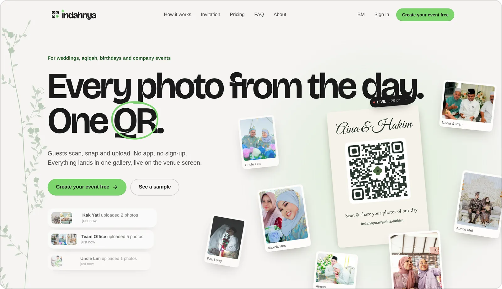

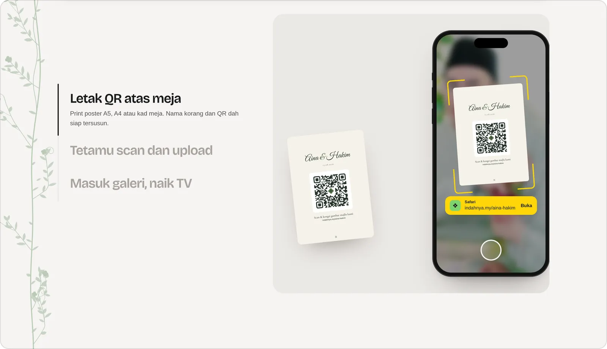

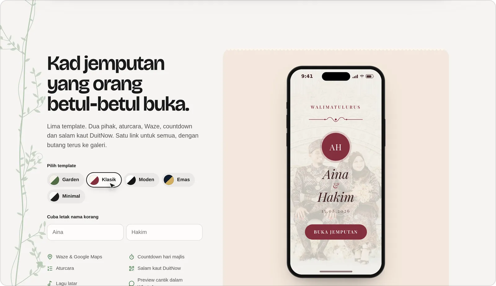

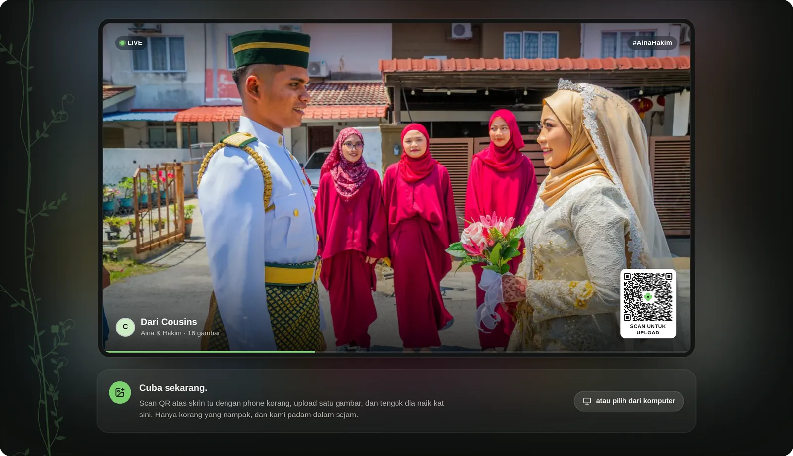

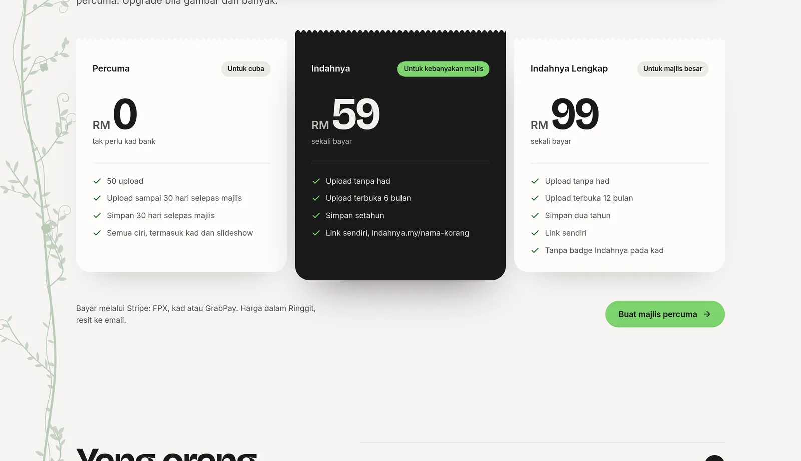

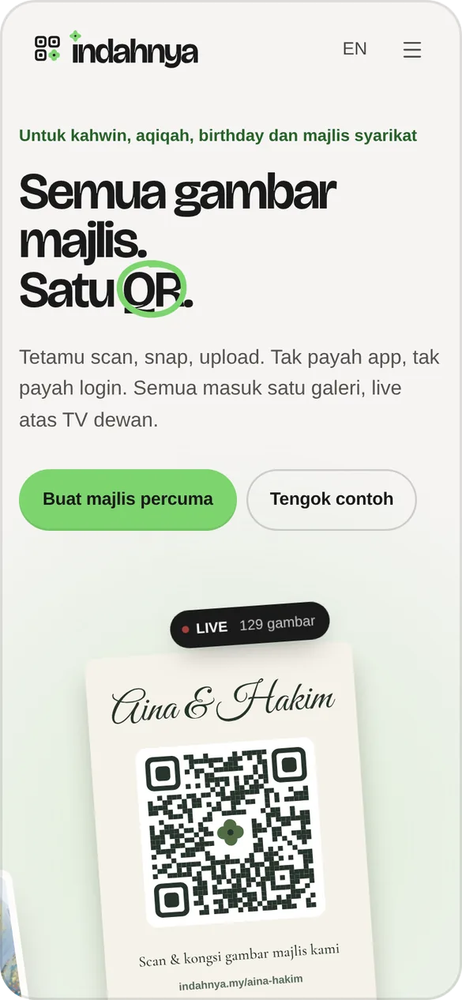

## Guest pages (`/[slug]`)

What a guest sees after scanning. Phone first, because that's where guests
are.

<table>
  <tr>
    <td align="center" width="33%">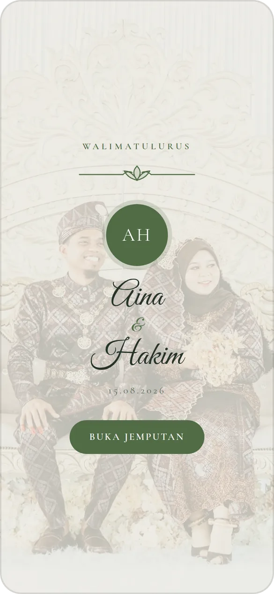 Kad: cover</td>
    <td align="center" width="33%">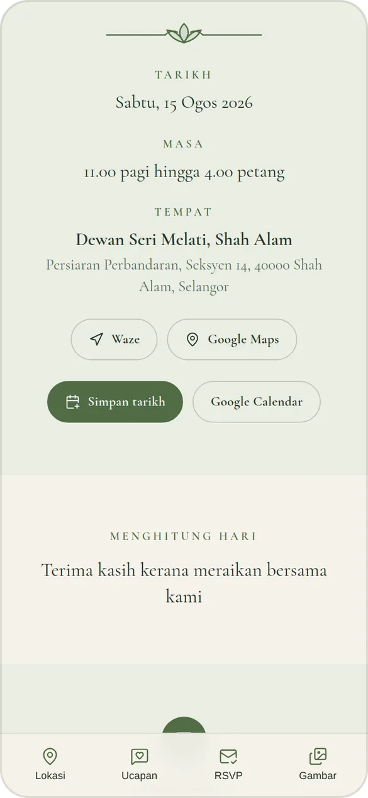 Kad: the day, venue and calendar</td>
    <td align="center" width="33%">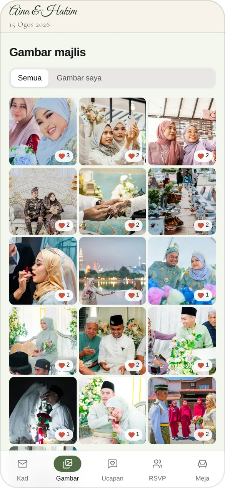 Gambar</td>
  </tr>
  <tr>
    <td align="center">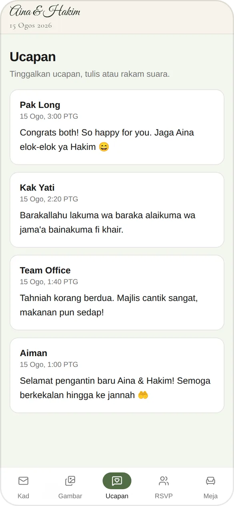 Ucapan</td>
    <td align="center">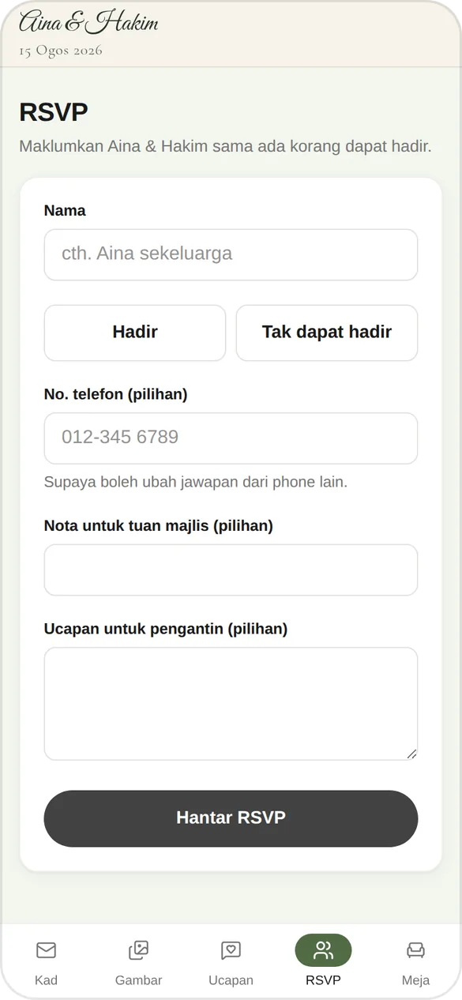 RSVP</td>
    <td align="center">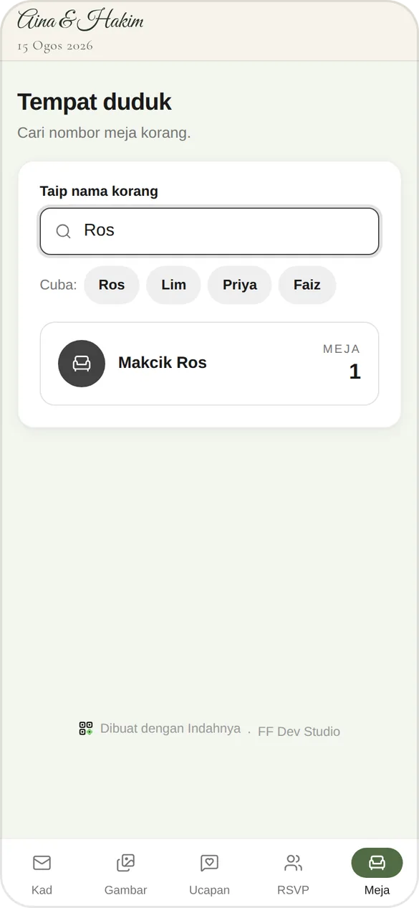 Tempat duduk</td>
  </tr>
</table>

The gallery on a desktop:

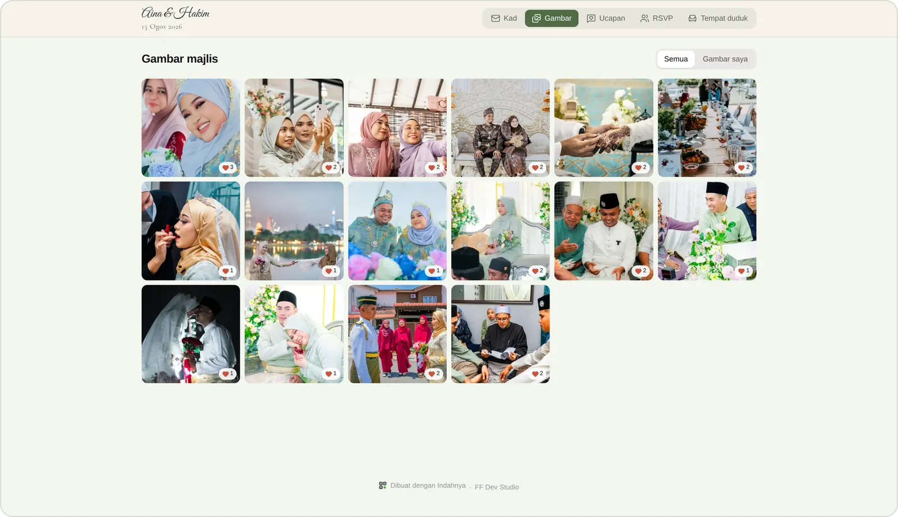

## Venue TV (`/tv/[slug]`)

## Host dashboard (`/app/[id]`)

### Ringkasan

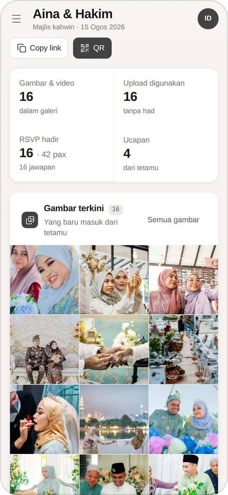

### Gambar

### Kad jemputan

### RSVP

### Tempat duduk

### Ucapan

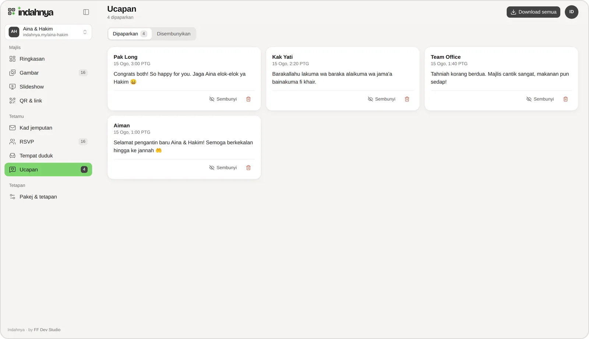

### QR & link

### Pakej & tetapan

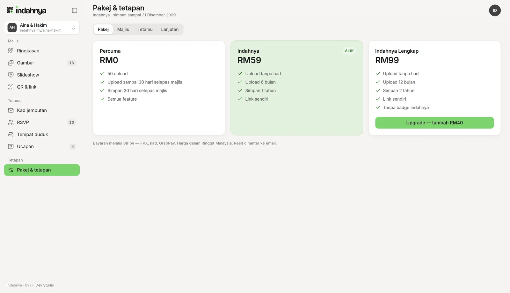
